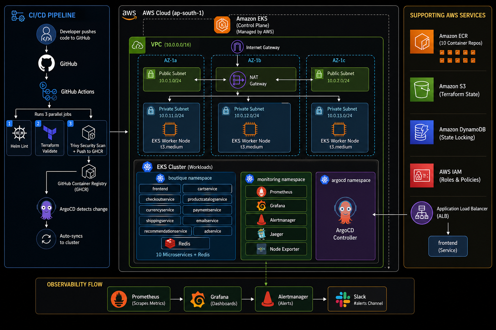

# Online Boutique — DevOps & SRE Portfolio Project

> Google's [Online Boutique](https://github.com/GoogleCloudPlatform/microservices-demo) provides the application source code only. **Every single DevOps and SRE file in this repository — Helm chart, Terraform, CI/CD pipelines, ArgoCD GitOps config, observability stack, chaos experiments, and runbooks — was deleted from the upstream repo and rebuilt completely from scratch.** This is not a deployment of someone else's infrastructure. This is an independently engineered production-grade platform built on top of a real polyglot microservices application.

---

## Why built from scratch

The upstream Online Boutique repo ships with GCP-specific deployment files — Cloud Build configs, Skaffold, GCP Terraform, and a GCP-optimised Helm chart. All of that was deliberately deleted.

The intent of this project is to demonstrate the ability to **design and build DevOps/SRE infrastructure independently** — not to follow a tutorial or deploy pre-written configs. Every architectural decision, every Helm template, every Terraform module, every alert rule, and every runbook in this repo was written by hand with a clear understanding of why it exists.

This is the difference between knowing how to use a tool and knowing how to engineer with one.

---

## Table of contents

- [Project overview](#project-overview)
- [Architecture](#architecture)
- [Repository structure](#repository-structure)
- [Phase 1 — Helm chart](#phase-1--helm-chart)
- [Phase 2 — GitOps with ArgoCD](#phase-2--gitops-with-argocd)
- [Phase 3 — Terraform + AWS EKS](#phase-3--terraform--aws-eks)
- [Phase 4 — Observability](#phase-4--observability)
- [Phase 5 — CI/CD with GitHub Actions](#phase-5--cicd-with-github-actions)
- [Phase 6 — Full EKS Production Deployment](#phase-6--full-eks-production-deployment)
- [Roadmap](#roadmap)
- [Tech stack](#tech-stack)

---

## Project overview

This project demonstrates end-to-end DevOps and SRE engineering on a real polyglot microservices application — 10 services written in Go, Python, Java, C#, and Node.js, communicating over gRPC.

The goal is not just to deploy the app, but to **operate it like a production SRE team would** — with Helm-packaged deployments, GitOps-driven delivery, full observability, and chaos engineering to validate resilience.

### What makes this different from a tutorial project

| Typical "deployed on K8s" project | This project |
|---|---|
| Raw YAML manifests copy-pasted | Single Helm chart parameterising all 10 services |
| One namespace, no isolation | Dedicated namespace per environment |
| No resource limits | CPU/memory requests and limits on every pod |
| No pod disruption budgets | PDBs on all stateful services |
| No autoscaling | HPA configured on all 10 services |
| Manual kubectl apply to deploy | ArgoCD auto-syncs on every GitHub push |
| Infrastructure clicked in console | Terraform modules — reproducible, version-controlled |
| No observability | Prometheus + Grafana SLO dashboards + Jaeger tracing |
| No alerting | Alertmanager → Slack real-time incident notifications |
| No CI pipeline | GitHub Actions — lint, validate, Trivy scan, GHCR push |

---

## Architecture



The application is Google's Online Boutique — an e-commerce storefront with 10 backend microservices and a Redis cart store.

```
User → frontend (Go, HTTP)
         │
         ├── productcatalogservice (Go, gRPC)
         ├── currencyservice (Node.js, gRPC)
         ├── cartservice (C#, gRPC) ← Redis
         ├── recommendationservice (Python, gRPC)
         ├── adservice (Java, gRPC)
         └── checkoutservice (Go, gRPC)
                  │
                  ├── paymentservice (Node.js, gRPC)
                  ├── shippingservice (Go, gRPC)
                  └── emailservice (Python, gRPC)
```

### Service inventory

| Service | Language | Port | Role |
|---|---|---|---|
| frontend | Go | 8080 | HTTP entry point, calls all services |
| cartservice | C# | 7070 | Manages user cart, backed by Redis |
| productcatalogservice | Go | 3550 | Serves product list from JSON |
| currencyservice | Node.js | 7000 | Currency conversion |
| paymentservice | Node.js | 50051 | Mock payment charge |
| shippingservice | Go | 50051 | Mock shipping quote and order |
| emailservice | Python | 8080 | Mock order confirmation email |
| recommendationservice | Python | 8080 | Cart-based product recommendations |
| adservice | Java | 9555 | Context-aware advertisement service |
| checkoutservice | Go | 5050 | Orchestrates the full checkout flow |
| redis-cart | Redis | 6379 | Cart session storage |

---

## Repository structure

```
.
├── src/                          # App source — only thing kept from upstream
├── protos/                       # gRPC proto definitions
├── helm/                         # Helm chart — built from scratch
│   ├── Chart.yaml
│   ├── values.yaml
│   ├── values-dev.yaml
│   └── templates/
│       ├── _helpers.tpl
│       ├── deployment.yaml
│       ├── service.yaml
│       ├── hpa.yaml
│       └── poddisruptionbudget.yaml
├── argocd/
│   └── application.yaml
├── terraform/
│   ├── modules/
│   │   ├── vpc/
│   │   ├── eks/
│   │   └── ecr/
│   └── envs/prod/
│       ├── main.tf
│       ├── variables.tf
│       ├── outputs.tf
│       ├── backend.tf
│       └── terraform.tfvars
├── monitoring/
│   ├── prometheus/
│   │   ├── servicemonitor.yaml
│   │   └── rules/
│   │       └── slo-rules.yaml
│   ├── grafana/
│   │   └── dashboards/
│   │       └── sre-overview.json
│   └── alertmanager-config.yaml  # Slack config — DO NOT COMMIT real webhook URL
├── .github/
│   └── workflows/
│       ├── helm-lint.yaml
│       ├── terraform-validate.yaml
│       └── image-scan-push.yaml
├── chaos/                        # LitmusChaos experiment YAMLs
├── runbooks/                     # Operational runbooks
├── load-testing/                 # k6 load test scenarios
└── docs/
    └── architecture.png          # Full AWS + CI/CD architecture diagram
```

### Everything deleted from upstream and why

| Deleted from upstream | Why deleted | Rebuilt as |
|---|---|---|
| `kubernetes-manifests/` | Raw YAML, no templating, no env management | `helm/templates/` |
| `helm-chart/` | GCP-specific, not portable to AWS | `helm/` — cloud-agnostic, AWS-ready |
| `terraform/` | Targets GCP, not AWS | `terraform/` — AWS EKS modules |
| `kustomize/` | Redundant — Helm handles env overlays | `values-dev.yaml`, `values-prod.yaml` |
| `istio-manifests/` | GCP service mesh, not used | NetworkPolicies in Helm instead |
| `.github/` | GCP Cloud Build workflows | `.github/workflows/` — GitHub Actions CI |
| `skaffold.yaml` | GCP-specific dev tool | Replaced by Helm + ArgoCD GitOps |
| `loadgenerator/` | Black box Locust container | `load-testing/` — custom k6 scenarios |
| `cloudbuild.yaml` | GCP Cloud Build | GitHub Actions CI pipeline |
| `docs/` | GCP deployment guides | This README + architecture diagram |
| `.deploystack/` | GCP-specific tooling | Not needed |

The git history from the upstream repo was also wiped (`rm -rf .git`) and a fresh repository was initialised — so every commit in this repo represents work done on this project, not inherited history from Google.

---

## Phase 1 — Helm chart

**Status: complete and validated on kind**

### Prerequisites

```bash
docker     >= 24.x
kubectl    >= 1.28
helm       >= 3.14
kind       >= 0.22
```

### Local deployment with kind

**1. Create the kind cluster**

```yaml
# kind-config.yaml
kind: Cluster
apiVersion: kind.x-k8s.io/v1alpha4
nodes:
  - role: control-plane
  - role: worker
  - role: worker
  - role: worker
```

```bash
kind create cluster --name boutique --config kind-config.yaml
kubectl get nodes
```

**2. Deploy with Helm**

```bash
kubectl create namespace boutique
helm install boutique ./helm --namespace boutique --create-namespace
kubectl get pods -n boutique
```

**3. Access the frontend**

```bash
kubectl port-forward svc/frontend 8080:8080 -n boutique
```

Open `http://localhost:8080` in your browser.

**4. Upgrade after values changes**

```bash
helm upgrade boutique ./helm --namespace boutique
```

**5. Tear down**

```bash
helm uninstall boutique --namespace boutique
kind delete cluster --name boutique
```

### Helm chart design decisions

**One template per resource type, not per service**

A single `deployment.yaml` iterates over all services using `{{- range $name, $svc := .Values.services }}`. Adding a new service requires only one block in `values.yaml` — zero new template files.

**Security context on every pod**

```yaml
securityContext:
  runAsNonRoot: true
  runAsUser: 1000
  allowPrivilegeEscalation: false
  readOnlyRootFilesystem: true
  capabilities:
    drop:
      - ALL
```

**HPA on all 10 services** — 70% CPU utilisation target, disabled in `values-dev.yaml`.

**PodDisruptionBudget on all backend services** — `minAvailable: 1` prevents eviction of last running pod.

**Frontend serviceType configurable** — `serviceType: NodePort` locally, `serviceType: LoadBalancer` on EKS. Controlled via `values.yaml` so ArgoCD GitOps manages the service type automatically.

### Debugging a real production issue

Frontend entered `CrashLoopBackOff` while all other 9 services started successfully.

```bash
kubectl logs frontend-xxx -n boutique
# panic: environment variable "SHOPPING_ASSISTANT_SERVICE_ADDR" not set
```

`v0.10.1` introduced a new required env variable. Kubernetes silently strips `value: ""` from the env spec. Fix:

```yaml
- name: SHOPPING_ASSISTANT_SERVICE_ADDR
  value: "shoppingassistantservice:80"
```

---

## Phase 2 — GitOps with ArgoCD

**Status: complete and validated on kind + EKS**

### How it works

```
Push to GitHub → ArgoCD detects drift → syncs Helm chart → cluster updated
```

### ArgoCD installation

```bash
helm repo add argo https://argoproj.github.io/argo-helm
helm repo update
kubectl create namespace argocd
helm install argocd argo/argo-cd \
  --namespace argocd \
  --set configs.params."server\.insecure"=true
kubectl get pods -n argocd
```

### ArgoCD Application manifest

```yaml
apiVersion: argoproj.io/v1alpha1
kind: Application
metadata:
  name: online-boutique
  namespace: argocd
spec:
  project: default
  source:
    repoURL: https://github.com/Shrinidhi972004/microservices-devops-sre-project.git
    targetRevision: main
    path: helm
    helm:
      valueFiles:
        - values.yaml
        - values-dev.yaml
  destination:
    server: https://kubernetes.default.svc
    namespace: boutique
  syncPolicy:
    automated:
      prune: true
      selfHeal: true
    syncOptions:
      - CreateNamespace=true
      - ServerSideApply=true
```

```bash
kubectl apply -f argocd/application.yaml
kubectl get application -n argocd

# Access UI
kubectl -n argocd get secret argocd-initial-admin-secret \
  -o jsonpath="{.data.password}" | base64 -d && echo
kubectl port-forward svc/argocd-server 8081:80 -n argocd
```

---

## Phase 3 — Terraform + AWS EKS

**Status: complete — infrastructure provisioned, app deployed, resources destroyed**

### Step 1 — Create IAM user with required permissions

Create an IAM user `boutique-devops` with these policies:
- `AmazonEKSClusterPolicy`, `AmazonEKSServicePolicy`, `AmazonEC2FullAccess`
- `AmazonS3FullAccess`, `AmazonDynamoDBFullAccess`, `IAMFullAccess`
- `AmazonVPCFullAccess`, `AmazonEC2ContainerRegistryFullAccess`
- Custom inline policy for `eks:*` and all IAM role operations

```bash
aws configure --profile boutique
export AWS_PROFILE=boutique
aws sts get-caller-identity  # verify
```

### Step 2 — Create S3 backend and DynamoDB lock table

```bash
export AWS_REGION=ap-south-1
export ACCOUNT_ID=$(aws sts get-caller-identity --query Account --output text)

aws s3api create-bucket \
  --bucket boutique-terraform-state-${ACCOUNT_ID} \
  --region ${AWS_REGION} \
  --create-bucket-configuration LocationConstraint=${AWS_REGION}

aws s3api put-bucket-versioning \
  --bucket boutique-terraform-state-${ACCOUNT_ID} \
  --versioning-configuration Status=Enabled

aws s3api put-bucket-encryption \
  --bucket boutique-terraform-state-${ACCOUNT_ID} \
  --server-side-encryption-configuration \
  '{"Rules":[{"ApplyServerSideEncryptionByDefault":{"SSEAlgorithm":"AES256"}}]}'

aws dynamodb create-table \
  --table-name boutique-terraform-locks \
  --attribute-definitions AttributeName=LockID,AttributeType=S \
  --key-schema AttributeName=LockID,KeyType=HASH \
  --billing-mode PAY_PER_REQUEST \
  --region ${AWS_REGION}
```

### Step 3 — Configure backend.tf

Replace `YOUR_ACCOUNT_ID` in `terraform/envs/prod/backend.tf`:

```hcl
terraform {
  backend "s3" {
    bucket         = "boutique-terraform-state-YOUR_ACCOUNT_ID"
    key            = "prod/terraform.tfstate"
    region         = "ap-south-1"
    dynamodb_table = "boutique-terraform-locks"
    encrypt        = true
  }
}
```

### Step 4 — Init, plan, apply

```bash
cd terraform/envs/prod
terraform init
terraform plan -out=tfplan
terraform apply "tfplan"
```

Creates 48 resources. EKS takes ~20 minutes total.

### Step 5 — Connect kubectl to EKS

```bash
aws eks update-kubeconfig --region ap-south-1 --name boutique
kubectl get nodes -o wide
```

### Teardown

```bash
helm uninstall boutique -n boutique
cd terraform/envs/prod && terraform destroy -auto-approve

ACCOUNT_ID=$(aws sts get-caller-identity --query Account --output text)
aws s3api delete-objects \
  --bucket boutique-terraform-state-${ACCOUNT_ID} \
  --delete "$(aws s3api list-object-versions \
    --bucket boutique-terraform-state-${ACCOUNT_ID} \
    --query '{Objects: Versions[].{Key:Key,VersionId:VersionId}}' \
    --output json)" --region ap-south-1
aws s3api delete-bucket \
  --bucket boutique-terraform-state-${ACCOUNT_ID} --region ap-south-1
aws dynamodb delete-table \
  --table-name boutique-terraform-locks --region ap-south-1
```

---

## Phase 4 — Observability

**Status: complete and validated on kind + EKS**

### Stack overview

```
Prometheus      — scrapes metrics from all pods + Kubernetes internals
Grafana         — dashboards + SLO visualisation
Alertmanager    — routes alerts to Slack in real time
kube-state-metrics — cluster-level metrics (pod status, replica counts)
Node Exporter   — node-level metrics (CPU, memory per node)
Jaeger          — distributed tracing across gRPC service calls
ServiceMonitor  — tells Prometheus to scrape boutique namespace
PrometheusRules — SLO alerting rules + error budget burn rate
```

### Prerequisites

```bash
helm repo add prometheus-community https://prometheus-community.github.io/helm-charts
helm repo add grafana https://grafana.github.io/helm-charts
helm repo add jaegertracing https://jaegertracing.github.io/helm-charts
helm repo update
```

### IMPORTANT — After every system restart or power off (kind only)

kind nodes lose their inotify limits on every restart:

```bash
for node in $(kubectl get nodes -o name | sed 's/node\///'); do
  docker exec $node sysctl fs.inotify.max_user_instances=512
  docker exec $node sysctl fs.inotify.max_user_watches=524288
done

kubectl rollout restart deployment/prometheus-kube-state-metrics -n monitoring
kubectl get pods -n monitoring
```

### Install kube-prometheus-stack

```bash
kubectl create namespace monitoring

helm install prometheus prometheus-community/kube-prometheus-stack \
  --namespace monitoring \
  --timeout 10m \
  --wait=false \
  --set prometheus.prometheusSpec.retention=7d \
  --set prometheus.prometheusSpec.scrapeInterval=15s \
  --set grafana.adminPassword=boutique-grafana \
  --set grafana.service.type=NodePort \
  --set grafana.service.nodePort=30030 \
  --set alertmanager.enabled=true \
  --set nodeExporter.enabled=true \
  --set kubeStateMetrics.enabled=true \
  --set kube-state-metrics.image.tag=v2.13.0

kubectl get pods -n monitoring -w
```

**Important:** Pin `kube-state-metrics.image.tag=v2.13.0` — v2.18.0 has a liveness probe port mismatch bug causing permanent CrashLoopBackOff.

### Install Jaeger

```bash
helm install jaeger jaegertracing/jaeger \
  --namespace monitoring \
  --set allInOne.enabled=true \
  --set provisionDataStore.cassandra=false \
  --set provisionDataStore.elasticsearch=false \
  --set storage.type=memory \
  --set agent.enabled=false \
  --set collector.enabled=false \
  --set query.enabled=false \
  --timeout 5m \
  --wait=false
```

### Apply ServiceMonitor and SLO rules

```bash
kubectl apply -f monitoring/prometheus/servicemonitor.yaml
kubectl apply -f monitoring/prometheus/rules/slo-rules.yaml
```

### Slack alerting integration

```bash
# Edit monitoring/alertmanager-config.yaml — replace YOUR_SLACK_WEBHOOK_URL
kubectl apply -f monitoring/alertmanager-config.yaml
kubectl rollout restart statefulset/alertmanager-prometheus-kube-prometheus-alertmanager -n monitoring
```

Test alert:

```bash
ALERTMANAGER_POD=$(kubectl get pod -n monitoring \
  -l app.kubernetes.io/name=alertmanager \
  -o jsonpath='{.items[0].metadata.name}')

kubectl exec -n monitoring $ALERTMANAGER_POD -c alertmanager -- wget -qO- \
  --post-data='[{"labels":{"alertname":"TestAlert","severity":"critical","namespace":"boutique"},"annotations":{"summary":"Test alert","description":"Slack integration verified"}}]' \
  --header='Content-Type: application/json' \
  http://localhost:9093/api/v2/alerts
```

### SRE Overview dashboard

Import `monitoring/grafana/dashboards/sre-overview.json`:
Dashboards → Import → Upload JSON file

| Panel | Metric source |
|---|---|
| CPU usage by pod | cAdvisor |
| Memory usage by pod | cAdvisor |
| Healthy pods | kube-state-metrics |
| Network receive rate | cAdvisor |
| Network transmit rate | cAdvisor |
| Node CPU usage | node-exporter |
| Node memory usage | node-exporter |
| Pod restart count | kube-state-metrics |

### Debugging encountered during Phase 4

**Issue 1 — Promtail `too many open files`:** kind inotify limits too low. Fix: increase via `docker exec`. Must rerun after every restart.

**Issue 2 — kube-state-metrics CrashLoopBackOff:** v2.18.0 liveness probe port mismatch. Fix: pin to `v2.13.0`.

**Issue 3 — Grafana datasource conflict:** Loki ConfigMap provisioning failed. Fix: add datasources via Grafana UI directly.

**Issue 4 — Prometheus x509 error scraping boutique namespace:** TLS certificate verification failure after restart. Fix: `tlsConfig.insecureSkipVerify: true` in ServiceMonitor.

---

## Phase 5 — CI/CD with GitHub Actions

**Status: complete — all 3 pipelines passing**

### Pipeline overview

```
Push to main
      │
      ├── helm/** changed → Helm Lint
      │     └── helm lint + helm template dry run
      │
      ├── terraform/** changed → Terraform Validate
      │     └── terraform fmt check + validate all 3 modules
      │
      └── helm/** changed → Image Scan and Push
            ├── Pull upstream image from Google registry
            ├── Trivy security scan (CRITICAL + HIGH CVEs)
            ├── Upload scan results as GitHub artifacts
            └── Tag + push to GHCR
```

### Workflow 1 — Helm Lint

Triggers on `helm/**` changes. Runs `helm lint` + `helm template` dry run across all 10 services.

### Workflow 2 — Terraform Validate

Triggers on `terraform/**` changes. Runs `terraform fmt -check` + `terraform validate` on all 3 modules.

**Important:** Use Terraform `>= 1.9.0` — older versions have an expired OpenPGP signing key causing CI failures.

### Workflow 3 — Image Scan and Push

Runs 10 parallel jobs — one per service. Pulls upstream images, scans with Trivy, pushes to GHCR:

```
ghcr.io/shrinidhi972004/boutique/frontend:latest
ghcr.io/shrinidhi972004/boutique/cartservice:latest
... (10 total)
```

### Debugging encountered during Phase 5

**Issue 1 — Terraform OpenPGP key expired:** Fix: upgrade to `terraform_version: 1.9.0`.

**Issue 2 — Terraform fmt check failure:** Fix: run `terraform fmt -recursive terraform/` locally and commit.

**Issue 3 — GHCR push invalid reference:** `github.repository_owner` preserves uppercase. Fix: hardcode lowercase `ghcr.io/shrinidhi972004/boutique/` as a shell variable.

**Issue 4 — Slack webhook blocked by GitHub push protection:** Fix: `git filter-branch` to rewrite history, add file to `.gitignore`.

---

## Phase 6 — Full EKS Production Deployment

**Status: complete — all components deployed on AWS EKS, screenshots taken, resources destroyed**

This phase brings everything together — all 5 phases deployed simultaneously on a real AWS EKS cluster, proving the entire platform works end-to-end in production.

### What was deployed on EKS

```
boutique namespace   — all 10 microservices + Redis (Helm)
argocd namespace     — ArgoCD GitOps controller (Helm)
monitoring namespace — Prometheus + Grafana + Alertmanager + Jaeger (Helm)
```

All deployed with zero manual `kubectl apply` — Helm for initial install, ArgoCD managing ongoing state.

### Full deployment steps

**Step 1 — Provision EKS with Terraform (see Phase 3)**

```bash
cd terraform/envs/prod
terraform apply "tfplan"
aws eks update-kubeconfig --region ap-south-1 --name boutique
kubectl get nodes -o wide
```

**Step 2 — Deploy boutique app**

```bash
kubectl create namespace boutique
helm install boutique ./helm \
  --namespace boutique \
  -f helm/values.yaml
kubectl get pods -n boutique
```

**Step 3 — Deploy ArgoCD**

```bash
kubectl create namespace argocd
helm install argocd argo/argo-cd \
  --namespace argocd \
  --set configs.params."server\.insecure"=true

# Expose UI via LoadBalancer
kubectl patch svc argocd-server -n argocd \
  -p '{"spec": {"type": "LoadBalancer"}}'

# Get admin password
kubectl -n argocd get secret argocd-initial-admin-secret \
  -o jsonpath="{.data.password}" | base64 -d && echo

# Connect ArgoCD to GitHub repo
kubectl apply -f argocd/application.yaml
kubectl get application -n argocd
# Expected: SYNC STATUS = Synced, HEALTH STATUS = Healthy
```

**Step 4 — Deploy observability stack**

```bash
kubectl create namespace monitoring

helm install prometheus prometheus-community/kube-prometheus-stack \
  --namespace monitoring \
  --timeout 10m \
  --wait=false \
  --set prometheus.prometheusSpec.retention=7d \
  --set grafana.adminPassword=boutique-grafana \
  --set alertmanager.enabled=true \
  --set nodeExporter.enabled=true \
  --set kubeStateMetrics.enabled=true \
  --set kube-state-metrics.image.tag=v2.13.0

helm install jaeger jaegertracing/jaeger \
  --namespace monitoring \
  --set allInOne.enabled=true \
  --set provisionDataStore.cassandra=false \
  --set provisionDataStore.elasticsearch=false \
  --set storage.type=memory \
  --set agent.enabled=false \
  --set collector.enabled=false \
  --set query.enabled=false \
  --wait=false

kubectl apply -f monitoring/prometheus/servicemonitor.yaml
kubectl apply -f monitoring/prometheus/rules/slo-rules.yaml
```

**Step 5 — Expose all UIs via LoadBalancer**

```bash
# Grafana
kubectl patch svc prometheus-grafana -n monitoring \
  -p '{"spec": {"type": "LoadBalancer"}}'

# ArgoCD already patched in Step 3

# Get all external IPs
kubectl get svc -A | grep LoadBalancer
```

**Step 6 — Configure Alertmanager → Slack**

```bash
# Edit monitoring/alertmanager-config.yaml with real webhook URL
kubectl apply -f monitoring/alertmanager-config.yaml
kubectl rollout restart statefulset/alertmanager-prometheus-kube-prometheus-alertmanager -n monitoring
```

**Step 7 — Configure frontend as LoadBalancer via GitOps**

Rather than manually patching the service (which ArgoCD would revert due to `selfHeal: true`), update `values.yaml` to set `serviceType: LoadBalancer` for frontend and push to GitHub. ArgoCD auto-syncs the change and AWS provisions the ELB:

```bash
# In helm/values.yaml — add under frontend:
#   serviceType: LoadBalancer
git add helm/values.yaml helm/templates/service.yaml
git commit -m "feat(helm): frontend LoadBalancer for EKS"
git push origin main
# ArgoCD syncs within 3 minutes — ELB appears automatically
kubectl get svc frontend -n boutique -w
```

**Step 8 — Verify everything**

```bash
kubectl get pods -n boutique      # 11 pods Running
kubectl get pods -n monitoring    # 9 pods Running
kubectl get pods -n argocd        # 7 pods Running
kubectl get application -n argocd # Synced + Healthy
kubectl get svc -A | grep LoadBalancer
```

Access:
- Online Boutique → `http://<frontend-elb>:8080`
- ArgoCD UI → `http://<argocd-elb>`
- Grafana → `http://<grafana-elb>` (admin / boutique-grafana)

### GitOps proven on EKS

The ArgoCD `selfHeal: true` setting was demonstrated live — manually patching the frontend service type was immediately reverted by ArgoCD. The correct fix was to update `values.yaml` in GitHub and let ArgoCD reconcile it. This proves GitHub is truly the single source of truth.

### Teardown — complete cleanup

```bash
helm uninstall boutique -n boutique
helm uninstall prometheus -n monitoring
helm uninstall jaeger -n monitoring
helm uninstall argocd -n argocd

cd terraform/envs/prod
terraform destroy -auto-approve

# Verify zero resources remain
aws eks list-clusters --region ap-south-1
aws ec2 describe-instances --region ap-south-1 \
  --query 'Reservations[*].Instances[*].[InstanceId,State.Name]' --output table
aws elbv2 describe-load-balancers --region ap-south-1 \
  --query 'LoadBalancers[*].[LoadBalancerName,State.Code]' --output table
aws ec2 describe-nat-gateways --region ap-south-1 \
  --query 'NatGateways[?State!=`deleted`].[NatGatewayId,State]' --output table
```

---

## Roadmap

| Phase | Status | Description |
|---|---|---|
| Phase 1 — Helm chart | ✅ Complete | Single Helm chart for all 10 services, validated on kind |
| Phase 2 — GitOps with ArgoCD | ✅ Complete | ArgoCD watching GitHub, auto-sync with self-healing |
| Phase 3 — Terraform + AWS EKS | ✅ Complete | Modular Terraform, EKS cluster, VPC, ECR |
| Phase 4 — Observability | ✅ Complete | Prometheus + Grafana + Jaeger + Alertmanager → Slack |
| Phase 5 — CI/CD | ✅ Complete | GitHub Actions — Helm lint, Terraform validate, Trivy scan, GHCR push |
| Phase 6 — Full EKS deployment | ✅ Complete | All phases deployed together on AWS EKS, GitOps proven end-to-end |

---

## Tech stack

| Category | Tool |
|---|---|
| Container orchestration | Kubernetes (kind locally, AWS EKS in cloud) |
| Package management | Helm 3 |
| GitOps | ArgoCD |
| Infrastructure as code | Terraform (AWS provider) |
| CI/CD | GitHub Actions |
| Image registry | GitHub Container Registry (GHCR) |
| Security scanning | Trivy |
| Metrics | Prometheus + Grafana |
| Alerting | Alertmanager + Slack |
| Tracing | Jaeger |
| Container registry | AWS ECR |
| Cloud | AWS (EKS, ECR, S3, VPC, DynamoDB, IAM, ALB) |

---

## Author

**Shrinidhi Upadhyaya**
- GitHub: [@Shrinidhi972004](https://github.com/Shrinidhi972004)
- Email: shrinidhiupadhyaya00@gmail.com